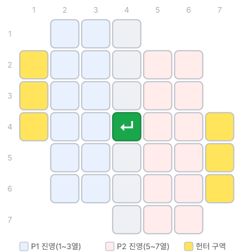
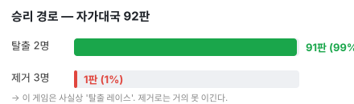
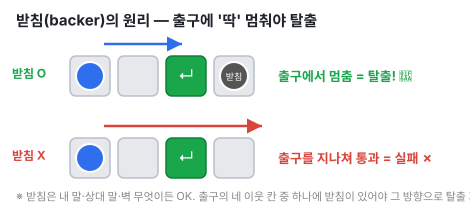
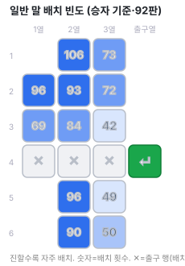
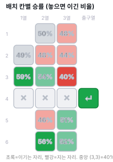
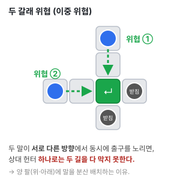
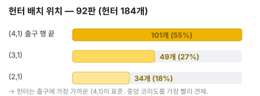
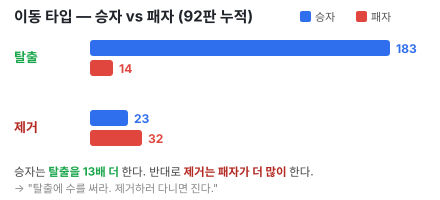

# 출구 전략 3 — 전략 교재 (데이터 기반)

> 바둑의 정석·격언처럼, **이 게임의 전략을 우리 엔진의 실제 데이터로** 공부하는 자료입니다.
> 모든 수치는 게임에 내장된 **MCTS 엔진의 자가대국 92판**(양측 동일 엔진, 수당 ~50ms)에서 직접 뽑았습니다.
> *중간 강도·유한 표본이라 칸별 승률 같은 세부 수치는 "경향"으로 읽어 주세요. 큰 결론(탈출 레이스·템포·2열 집중)은 빈도·승률·기하학이 모두 일관되게 가리킵니다.*
>
> 📌 **이미지는 GitHub에서 보면 렌더됩니다.** (로컬에서 `.md`는 글자만 보일 수 있어요.)

위가 게임판입니다. **37칸 십자형(180° 회전 대칭)**, 가운데 초록이 **출구**, 노란 칸이 **헌터 배치 구역**. 왼쪽(파랑)이 P1, 오른쪽(빨강)이 P2 진영입니다.

---

## 0. 한눈에 보는 핵심 격언 (먼저 외울 것)

> 1. **"이 게임은 탈출 레이스다."** — 승리 92판 중 **91판이 탈출**, 제거 승은 단 1판.
> 2. **"먼저 탈출한 쪽이 이긴다."** — 첫 탈출 성공 측이 **89%** 승리.
> 3. **"헌터로 잡으러 다니지 마라."** — 제거는 **패자가 더 많이** 함(승자 23 vs 패자 32). 헌터는 킬러가 아니라 **수문장**.
> 4. **"출구 4방 이웃이 전부다."** — 탈출은 출구 뒤 *받침*이 있어야만 성립. 이 4칸을 두고 싸운다.
> 5. **"중앙보다 2열·가장자리, 그리고 양 팔."** — 승자의 배치가 데이터로 그렇게 말한다.

---

## 1. 이 게임의 본질 — "탈출 레이스"

| 승리 경로 | 판수 (92판) |
|---|---|
| **탈출 2명** | **91 (99%)** |
| 제거 3명 | 1 (1%) |

목표는 둘(2탈출 / 3제거)이지만 **실전 승부는 거의 항상 탈출로 갈립니다.** 평균 게임 길이는 약 51수(배치 12 + 이동), 짧으면 23수에 끝납니다.

> **그래서 모든 계획의 1순위는 "내 말 2명을 먼저 내보낸다."** 제거는 목적이 아니라 *수단*입니다.

---

## 2. 탈출의 사활(死活) 원리 — **받침(backer)**

- 일반 말은 **직선으로 슬라이드**하다 벽·다른 말에 닿으면 멈춥니다.
- 출구는 **그냥 지나가면 탈출이 아니고**, 이동 끝에 **출구 칸에 "딱" 멈출 때만** 탈출입니다.
- 출구의 **네 이웃((3,4)·(5,4)·(4,3)·(4,5))은 모두 보드 안**입니다. 즉 **출구 바로 뒤에 "받침"이 있어야만** 그 자리에서 멈춰 탈출할 수 있습니다.

**핵심 명제:** **탈출은 "출구의 네 이웃 칸 중 하나에 받침이 있을 때만" 성립한다.** 그래서 이 게임의 진짜 싸움터는 **출구를 둘러싼 4칸**입니다.

- **공격**: 내 말(또는 상대 말!)을 받침으로 세워 내 탈출 길을 연다.
- **수비**: 그 4칸을 점거/차단하거나, **헌터로 상대의 받침을 제거**해 상대 탈출을 무산시킨다.

> 💡 받침은 *상대 말이어도 됩니다.* 내 말을 출구 옆에 함부로 두면 상대 탈출을 도와주는 꼴이 되기도 합니다.

---

## 3. 승리 전략 (큰 그림)

- **선공이 약간 유리** — P1 54% : P2 46% (거의 호각, 실수 한 번이 승부).
- **템포가 거의 전부** — 첫 탈출 측 **89%** 승. 두 말의 탈출 경로를 *동시에* 준비해 반 박자 앞서라.
- **두 갈래로 위협** — 한쪽만 노리면 막힙니다(다음 장).
- **승률 50%가 분기점** — 분석을 켜면 보이는 추천수 승률이 50% 밑으로 떨어지는 순간이 *이미 밀린 수*. (→ 8장 복기)

---

## 4. 배치 정석 (포석) — **어디에, 왜?**

### 4-1. 데이터: 어디에 두는가

 

- **왼쪽(빈도)**: 승자들은 **2열**과 모서리(2,1)에 집중하고, **위·아래 양 팔**을 모두 씁니다.
- **오른쪽(승률)**: 놓으면 이긴 비율. **(3,1) 59%·(6,2) 56%·(3,2) 54%** 가 높고, **중앙 쪽 (3,3) 40%·(2,3) 44%** 가 낮습니다.

### 4-2. **왜 2열·가장자리이고, 왜 중앙(3열)을 피하나?**

데이터가 보여주는 경향에 *이유*를 붙이면:

1. **슬라이드 유연성.** 말은 부딪힐 때까지 직선으로 미끄러집니다. **2열**에 있으면 중앙으로 밀 때 *멈출 지점 선택지(런웨이)* 가 많습니다. **3열**은 이미 출구열 코앞이라 한 번 움직이면 바로 빨려가 *되돌릴 여지가 적고* 위치가 고정됩니다.
2. **헌터 노출.** 상대 헌터는 **중앙 코리도**로 견제하러 옵니다. 중앙(3열) 말은 *헌터 사정권에 빨리 들어가* 잡히거나 길이 막힙니다. **가장자리(1열)·2열**은 헌터가 닿기 어려워 안전하게 키웁니다. → (3,1) 가장자리가 59%로 최고인 이유.
3. **받침 동선.** 탈출하려면 출구 이웃에 받침을 세우고 정렬해야 합니다. 2열·가장자리에서 출발하면 출구로 가는 *각도와 받침 만들 동선*이 풍부합니다. **(3,3)은 출구와 대각선**이라 직선 슬라이드로 출구에 깔끔히 멈추기 까다로워 **40%로 최악**.
4. **양 팔 = 이중 위협.** 위(1~3행)·아래(5~6행)에 나눠 두면 출구를 두 방향에서 동시에 노립니다. (6,2)·(3,2) 같은 *양 팔 2열*이 고승률인 이유입니다 ↓

> **배치 원칙 요약:** ① 2열에 집중 ② 가장자리(1열)도 활용 ③ 위·아래 양 팔에 분산 ④ 중앙 (3,3)·(2,3)은 피하기 ⑤ 출구 행/열엔 못 놓으니, *한 수면 출구에 정렬되는* 자리를 고르기.

### 4-3. 헌터 배치 — **(4,1)이 표준**

헌터 184개 중 **(4,1)에 101개(55%)**. **출구 행(4행)에 가장 가까운 칸**이라 가운데 코리도로 **가장 빨리 진입**해 받침을 견제·차단할 수 있기 때문입니다.

> 🛠 **실전 팁:** 배치할 때 **분석 표시 ON + "정밀/심층/무제한"** 으로 두면, 칸마다 승률 배지가 떠서 위 정석을 *눈으로* 확인하며 놓을 수 있습니다.

---

## 5. 기물 이동 우선순위 — **무엇을, 왜 먼저?**

데이터가 가리키는 우선순위와 *이유*:

1. **[최우선] 탈출 가능하면 즉시 탈출.** 특히 **두 번째 탈출 = 그 자리에서 승리.**
   *왜?* 탈출이 곧 득점이고 2개면 게임이 끝납니다 — 정의상 가장 가치 높은 수.
2. **상대의 "탈출 임박"을 차단.** 상대가 받침+정렬을 완성했으면 다음 수에 실점합니다 → 그 받침을 치우거나(헌터) 길목을 점거.
   *왜?* 막는 한 수는 *상대의 승리 한 수를 지우는* 것과 같습니다(템포 역전).
3. **내 탈출 셋업 전진 (두 말 동시).** 출구 행·열 정렬 + 받침 확보를 한 수씩, *두 갈래로*.
   *왜?* 두 위협이면 상대 헌터 하나로 다 못 막습니다(4-2 그림).
4. **[하지 말 것] 의미 없는 제거 추격.**
   *왜?* 데이터 — 승자는 탈출을 **183번**, 패자는 제거를 **32번**(승자보다 많이) 했습니다. 제거 한 수는 *내 탈출 레이스에서 한 템포 손해*이고, 제거로 이긴 판은 92판 중 1판뿐입니다.

> 격언: **"탈출 한 수 > 제거 한 수."** 제거는 *상대 받침/임박 탈출을 지울 때만* 의미가 있습니다.

---

## 6. 헌터 활용법 — "킬러가 아니라 수문장"

| 항목 | 수치 | 시사점 |
|---|---|---|
| 제거로 이긴 판 | 1 / 92 | 제거는 승리 경로가 아님 |
| 헌터 제거/판 (승자) | 0.25 | 거의 안 잡음 |
| 헌터 제거/판 (패자) | **0.35** | 진 쪽이 더 잡음 → 추격은 손해 |

### 헌터의 올바른 3가지 용도
1. **받침 차단/제거 (수비의 핵심).** 상대가 출구 옆에 세운 **받침을 제거**하면 상대 탈출이 통째로 무산됩니다 — 헌터의 가장 가치 있는 한 수.
2. **길목 점거.** 출구 이웃 4칸·상대 정렬 경로를 막아 탈출을 봉쇄.
3. **탈출 풀 줄이기(선택적).** 상대 일반 말을 하나 줄이면(5→4명) "2명 탈출" 난이도가 올라갑니다. *단, 한 수 쓰는 만큼 내 템포도 줄어드니* 확실할 때만.

> ⚠️ 헌터끼리는 못 잡고, 헌터는 출구를 통과/탈출할 수 없습니다. 그래서 헌터는 "점수 사냥"이 아니라 **지역 통제**의 말입니다.

---

## 7. 정석·격언 모음 (복습)

- 📌 **"제거는 미끼, 탈출이 목적."** (제거 승 1%)
- 📌 **"먼저 탈출한 쪽이 이긴다."** (89%)
- 📌 **"출구 뒤 받침을 먼저 그려라."** (탈출의 전제)
- 📌 **"중앙보다 2열·가장자리, 양 팔을 다 써라."** (배치 히트맵)
- 📌 **"헌터는 (4,1)에서 출발해 길을 막아라."** (헌터 정석)
- 📌 **"두 갈래 위협이면 헌터 하나로 못 막는다."**
- 📌 **"헌터로 잡으러 가지 마라."** (패자가 더 잡음)

---

## 8. 우리 분석 기능으로 "복기"하는 법

이 게임엔 알파고식 실시간 분석이 내장돼 있습니다. 교재를 **직접 검증**하며 실력을 올리세요.

1. **분석 표시 ON**, 강도는 **정밀/심층**(중요한 수는 **무제한**으로 끝까지 수렴시키기).
2. **blue spot(최적수)을 맹신하지 말고 "승률 숫자"를 보라.** blue spot은 *지는 자리에서도* 항상 "그나마 최선"을 가리킵니다. 추천수 승률이 **50% 밑으로 떨어지는 순간 = 이미 밀린 것.**
3. **승률 추이 차트(📈)로 복기.** 한 판을 두고 *선이 꺾여 내려간 지점*을 찾으면 **거기가 패착**입니다. 그 수만 무르기로 되돌려 다른 수를 시험하세요.
4. **학습 루프:** 두기 → 추이에서 패착 찾기 → 무르기 → 분석으로 더 나은 수 확인 → 다시. (바둑의 복기와 동일)

---

## 부록 A. 데이터 방법론 (재현 가능)

- **표본**: MCTS 자가대국 **92판**, 양측 동일 엔진, 수당 ~50ms.
- **수집**: 승자/승리유형/게임길이/첫 탈출 주체/헌터 제거수/배치 좌표(자기 진영 프레임으로 정규화)/이동 타입(승자·패자별).
- **한계**: 중간 강도·유한 표본. 칸별 승률(40~59%)은 표본 노이즈를 포함하니 "경향"으로 읽으세요. 더 강한 엔진(심층/무제한)·수백 판이면 더 정밀해집니다.
- **재현**: 게임의 `mctsSearch()` 엔진으로 동일 통계를 다시 뽑을 수 있습니다.

## 부록 B. 핵심 수치 요약표

| 지표 | 값 |
|---|---|
| 선공(P1) 승률 | 54% |
| 탈출 승 / 제거 승 | **91 / 1** |
| 첫 탈출 측 승률 | **89%** |
| 평균 게임 길이 | 51수, 23~95 |
| 헌터 제거/판 (승자·패자) | 0.25 · 0.35 |
| 이동 타입(승자): 탈출·제거 | 183 · 23 |
| 이동 타입(패자): 탈출·제거 | 14 · 32 |
| 최선호 헌터 배치 | (4,1) 55% |
| 최고 승률 배치칸 | (3,1) 59%, (6,2) 56% |
| 최저 승률 배치칸 | (3,3) 40% |

---

*이 교재는 우리 엔진 데이터의 스냅샷입니다. 게임을 업그레이드(더 강한 엔진/AlphaZero)하면 정석도 함께 진화시킬 수 있습니다.*
